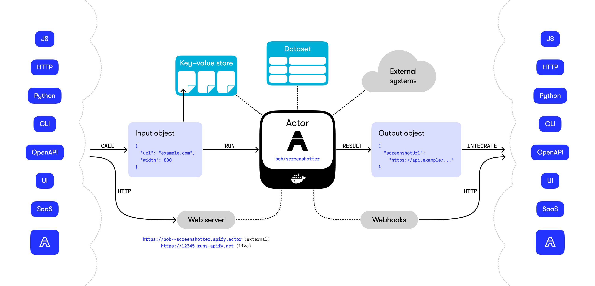

# The Web Actor Programming Model Whitepaper

**This whitepaper describes a new concept for building serverless microapps called **_Actors_**,
which are easy to develop, share, integrate, and build upon.
Actors are a reincarnation of the UNIX philosophy
for programs running in the cloud.**

By [Jan Čurn](https://apify.com/jancurn),
[Marek Trunkát](https://apify.com/mtrunkat),
[Ondra Urban](https://apify.com/mnmkng), and the entire Apify team.

**Version 0.999 (February 2025)**

## Contents

<!-- toc -->

- [Introduction](#introduction)
  * [Background](#background)
  * [Overview](#overview)
  * [Apify platform](#apify-platform)
- [Basic concepts](#basic-concepts)
  * [Input](#input)
  * [Run environment](#run-environment)
  * [Output](#output)
  * [Storage](#storage)
  * [Integrations](#integrations)
  * [What Actors are not](#what-actors-are-not)
- [Philosophy](#philosophy)
  * [UNIX programs vs. Actors](#unix-programs-vs-actors)
  * [Design principles](#design-principles)
  * [Relation to the Actor model](#relation-to-the-actor-model)
  * [Why the name "Actor"](#why-the-name-actor)
- [Installation and setup](#installation-and-setup)
  * [Running on the Apify platform](#running-on-the-apify-platform)
  * [Node.js](#nodejs)
  * [Python](#python)
  * [Command-line interface (CLI)](#command-line-interface-cli)
- [Actor programming interface](#actor-programming-interface)
  * [Initialization](#initialization)
  * [Get input](#get-input)
  * [Key-value store access](#key-value-store-access)
  * [Push results to dataset](#push-results-to-dataset)
  * [Exit Actor](#exit-actor)
  * [Environment variables](#environment-variables)
  * [Actor status](#actor-status)
  * [System events](#system-events)
  * [Get memory information](#get-memory-information)
  * [Start another Actor](#start-another-actor)
  * [Metamorph](#metamorph)
  * [Attach webhook to an Actor run](#attach-webhook-to-an-actor-run)
  * [Abort another Actor](#abort-another-actor)
  * [Reboot an Actor](#reboot-an-actor)
  * [Actor web server](#actor-web-server)
  * [Standby mode](#standby-mode)
  * [Migration to another server](#migration-to-another-server)
  * [Charging money](#charging-money)
- [Actor definition files](#actor-definition-files)
  * [Actor file](#actor-file)
  * [Dockerfile](#dockerfile)
  * [README](#readme)
  * [Input schema file](#input-schema-file)
  * [Output schema file](#output-schema-file)
  * [Storage schema files](#storage-schema-files)
  * [Backward compatibility](#backward-compatibility)
- [Development](#development)
  * [Local development](#local-development)
  * [Deployment to Apify platform](#deployment-to-apify-platform)
  * [Continuous integration and delivery](#continuous-integration-and-delivery)
  * [Actorizing existing code](#actorizing-existing-code)
- [Sharing and publishing](#sharing-and-publishing)
  * [Monetization](#monetization)
- [Future work](#future-work)
- [Links](#links)

<!-- tocstop -->

## Introduction

This whitepaper introduces **_Actors_**,
a new language-agnostic model for building general-purpose
web computing and automation programs (also known as agents, functions, or apps).
The main goal for Actors is to make it easy for developers to build and ship reusable
software tools, which are easy to run, integrate, and build upon.
Actors are useful for building
web scrapers, crawlers, automations, and AI agents.

### Background

Actors were first introduced by [Apify](https://apify.com/) in late 2017,
as a way to easily build, package, and ship web scraping and web automation jobs to customers.
Over the years, Apify has continued to develop the concept and applied
it successfully to thousands of real-world use cases in many business areas,
well beyond the domain of web scraping.

Building on this experience,
we're releasing this whitepaper to introduce the philosophy of Actors
to other developers and receive your feedback on it.
We aim to establish the Actor programming model as an open standard,
which will help the community to more effectively
build and ship reusable software automation tools,
as well as encourage new implementations of the model in other programming languages.

The goal of this whitepaper is to be the North Star that shows what the
Actor programming model is and what operations it should support.
**But this document is not an official specification.**
The specification will be an OpenAPI schema of the Actor system interface,
to enable new independent implementations of both the client libraries and backend systems. This is currently a work in progress.

Currently, the most complete implementation of the Actor model is provided
by the Apify platform, with SDKs for
[Node.js](https://sdk.apify.com/) and
[Python](https://pypi.org/project/apify/),
and a [command-line interface (CLI)](https://docs.apify.com/cli).
Beware that the frameworks might not yet implement all the features of the Actor programming model
described in this whitepaper.

### Overview

Actors are serverless programs that run in the cloud.
They can perform anything from simple actions such as
filling out a web form or sending an email,
to complex operations such as crawling an entire website,
or removing duplicates from a large dataset.
Actors can persist their state and be restarted, and thus they can
run as short or as long as necessary, from seconds to hours, even infinitely.

Basically, Actors are programs packaged as Docker images,
which accept a well-defined JSON input, perform
an action, and optionally produce a well-defined JSON output.

Actors have the following elements:

- **Dockerfile** which specifies where the Actor's source code is,
  how to build it, and run it.
- **Documentation** in a form of a README.md file.
- **Input and output schemas** that describe what input the Actor requires,
  and what results it produces.
- Access to an out-of-the-box **storage system** for Actor data, results, and files.
- **Metadata** such as the Actor name, description, author, and version.

The documentation and the input/output schemas make it possible for people to easily understand what the Actor does,
enter the required inputs both in user interface or API,
and integrate the results of the Actor into their other workflows.
Actors can easily call and interact with each other, enabling the building of more complex
systems on top of simple ones.

<!-- ASTRO: <Diagram horizontal={illuDiagramHoriz} vertical={illuDiagramVert} alt="Actor drawing" /> -->



<!-- Image sources: 
  https://docs.google.com/presentation/d/1nDgrI0p2r8ouP_t_Wn02aTllP8_Std-kRuIbO8QLE7M/edit
  https://www.figma.com/design/6vbmKvB6oY3b3mTN0oAscE/Actor-Whitepaper-Diagrams-and-Presentations?node-id=0-1&p=f&t=JwAJfru2GjdQBpBV-11
-->

### Apify platform

Actors can be published
on the [Apify platform](https://apify.com/store),
which automatically generates a rich website with documentation based on the README
and a practical user interface, in order to encourage people to try the Actor right away.
The Apify platform takes care of securely hosting the Actor's Docker containers
and scaling the computing, storage and network resources as needed,
so neither Actor developers nor the users need to deal with the infrastructure.
It just works.

The Apify platform provides an open API, cron-style scheduler, webhooks
and [integrations](https://apify.com/integrations)
to services such as Zapier or Make, which make it easy for users
to integrate Actors into their existing workflows. Additionally, the Actor developers
can set a price tag for the usage of their Actors, and thus earn income
and have an incentive to keep developing and improving the Actor for the users.
For details, see [Monetization](#monetization).

## Basic concepts

This section describes core features of Actors, what they are good for,
and how Actors differ from other serverless computing systems.

### Input

<!-- ASTRO:
<Illustration
    description="Each Actor accepts an input object, which tells it what it should do."
    position="content"
    image={illuBasicConceptsInput}
    noCaption
/>
-->

Each Actor accepts an **input object**, which tells it what it should do.
The object is passed in JSON format, and its properties have
a similar role as command-line arguments when running a program in a UNIX-like operating system.

For example, an input object for an Actor `bob/screenshotter` could look like this:

```json
{
  "url": "https://www.example.com",
  "width": 800
}
```

The input object represents a standardized way for the caller to control the Actor's activity,
whether starting it using API, user interface, CLI, or scheduler.
The Actor can access the value of the input object using the [Get input](#get-input) function.

In order to specify what kind of input object an Actor expects,
the Actor developer can define an [Input schema file](#input-schema-file).

The input schema is used by the system to generate user interface, API examples,
and simplify integration with external systems.

#### Example of auto-generated Actor input UI


<!-- ASTRO: <Picture src={illuTakerInput} alt="Taker input" formats={['avif', 'webp']} /> -->

### Run environment

<!-- ASTRO:
<Illustration
    description="The Actors run within an isolated Docker container"
    position="right"
    image={illuBasicConceptsRunEnvironment}
/>
-->

Actors run within an isolated Docker container with access to local file system and network,
and they can perform arbitrary computing activity or call external APIs.
The **standard output** of the Actor's program (stdout and stderr) is printed out and logged,
which is useful for development and debugging.

To inform the users about the progress, the Actors might set a [status message](#actor-status),
which is then displayed in the user interface and also available via API.

A running Actor can also launch a [web server](#actor-web-server),
which is assigned a unique local or public URL to receive HTTP requests. For example,
this is useful for messaging and interaction between Actors, for running request-response REST APIs, or
providing a full-featured website.

Actors can store their working data or results into specialized **storages**
called [Key-value store](#key-value-store) and [Dataset](#dataset) storages,
from which they can be easily exported using API or integrated in other Actors.

### Output

<!-- ASTRO:
<Illustration
    description="The Actors can generate an output object, which is a standardized way to display, consume, and integrate Actors' results."
    position="right"
    image={illuBasicConceptsOutput}
/>
-->

While the input object provides a standardized way to invoke Actors,
Actors can also generate an **output object**, which is a standardized way to display, consume, and integrate
Actors' results.

Actor results are typically fully available only after the Actor run finishes,
but the consumers of the results might want to access partial results during the run.
Therefore, Actors don't generate the output object in their code, but they
define an [Output schema file](#output-schema-file), which contains
instruction how to generate such output object automatically.

You can define how the Actor output looks using the [Output schema file](#output-schema-file).
The system uses this information to automatically generate an immutable JSON file,
which tells users where to find the results produced by the Actor.
The output object is stored by the system
to the Actor run object under the `output` property, and returned via API immediately when
the Actor is started, without the need to wait for it to finish or generate the actual results.
This is useful to automatically generate UI previews of the results, API examples,
and integrations.

<div class="clear-both" />

The output object is similar to the input object, as it contains properties and values.
For example, for the `bob/screenshotter` Actor, the output object could look like this:

```jsonc
{
  "screenshotUrl": "https://api.apify.com/v2/key-value-stores/skgGkFLQpax59AsFD/records/screenshot.jpg",
  "productImages": "https://api.apify.com/v2/key-value-stores/skgGkFLQpax59AsFD/records/product*.jpg",
  "productDetails": "https://api.apify.com/datasets/9dFknjkxxGkspwWd/records?fields=url,name",
  "productExplorer": "https://bob--screenshotter.apify.actor/product-explorer",
  // or this with live view
  "productExplorer": "https://13413434.runs.apify.net/product-explorer"
}

```

### Storage

<!-- ASTRO:
<Illustration
    description="The Actor system provides two specialized storages that can be used by Actors for storing files and results: Key-value store and Dataset"
    position="content"
    image={illuBasicConceptsStorage}
    noCaption
/>
-->

The Actor system provides two specialized storages that can be used by Actors for storing files and results:
**key-value store** and **dataset**, respectively. For each Actor run,
the system automatically creates so-called **default storages** of both these types
in empty state and makes them readily available for the Actor.

Alternatively, a caller can request reusing existing storage when starting a new Actor run.
This is similar to redirecting standard input in UNIX,
and it is useful if you want an Actor to operate on an existing key-value store or dataset instead of creating a new one.
<!-- TODO: The above feature is not implemented yet -->

Besides these so-called **default storages**, which are created or linked automatically, Actors are free to create new storages or
access existing ones, either by ID or a name that can be set for them (e.g. `bob/screenshots`).
The [input schema file](#input-schema-file) and [output schema file](#output-schema-file) provide special support for referencing these storages,
in order to simplify linking an output of one Actor to an input of another.
The storages are also accessible through an API and SDK externally, for example,
to download results when the Actor finishes.

Note that Actors are free to access any other external storage system through a third-party API, e.g.
an SQL database or a vector database.

#### Key-value store

<!-- ASTRO:
<Illustration
    description="The key-value store is a simple data storage that is used for saving and reading files or data records"
    position="right"
    image={illuBasicConceptsStorageKeyValueStore}
/>
-->

The key-value store is a simple data storage that is used for saving and reading
files or data records. The records are represented by a unique text key and the data associated with a MIME content type.
Key-value stores are ideal for saving things like screenshots, web pages, PDFs, or to persist the state of Actors e.g. as a JSON file.

Each Actor run is associated with a default empty key-value store, which is created exclusively for the run,
or alternatively with an existing key-value store if requested by the user on Actor start.
The [Actor input](#input) is stored as JSON file into the default key-value store under the key defined by
the `ACTOR_INPUT_KEY` environment variable (usually `INPUT`).
The Actor can read this input object using the [Get input](#get-input) function.

An Actor can read and write records to key-value stores using the API. For details,
see [Key-value store access](#key-value-store-access).

An Actor can define a schema for the key-value store to ensure files stored in it conform to certain rules.
For details, see [Storage schema files](#storage-schema-files).

#### Dataset

<!-- ASTRO:
<Illustration
    description="The dataset is an append-only storage that allows you to store a series of data objects such as results from web scraping, crawling, or data processing jobs."
    position="right"
    image={illuBasicConceptsStorageDataset}
/>
-->

The dataset is an append-only storage that allows you to store a series of data objects
such as results from web scraping, crawling, or data processing jobs.
You or your users can then export the dataset to formats such as JSON, CSV, XML, RSS, Excel, or HTML.

The dataset represents a store for structured data where each object stored has the same attributes,
such as online store products or real estate offers. You can imagine it as a table, where each object is
a row and its attributes are columns. Dataset is an append-only storage — you can only add new records to
it, but you cannot modify or remove existing records. Typically, it is used to store an array or collection of results,
such as a list of products or web pages.

An Actor can define a schema for the Dataset to ensure objects stored in it conform to certain rules.
For details, see [Storage schema files](#storage-schema-files).

### Integrations

<!-- ASTRO:
<Illustration
    description="Actors are designed for interoperability. Thanks to the input and output schemas, it's easy to connect Actors with external systems, be it directly via REST API, Node.js or Python clients, CLI, or no-code automations."
    position="content"
    image={illuBasicConceptsIntegrations}
    noCaption
/>
-->

**Actors are designed for interoperability.** Thanks to the input and output
schemas, it easy to connect Actors with external systems,
be it directly via REST API, Node.js or Python clients, CLI, or no-code automations.
From the schema files, the system can automatically generate API documentation, OpenAPI specification,
and validate inputs and outputs, simplifying their integrations to any other systems.

Furthermore, Actors can interact with themselves,
for example [start another Actors](#start-another-actor),
attach [Webhooks](#attach-webhook-to-an-actor-run) to process the results,
or [Metamorph](#metamorph) into another Actor to have it finish the work.

### What Actors are not

Actors are best suited for compute operations that take an input, perform an isolated job for a user,
and potentially produce some output.

For long-running jobs, Actor execution might be migrated
from server to another server, making it unsuitable for running dependable storage workloads
such as SQL databases.

As Actors are based on Docker, it takes a certain amount of time to spin up the container
and launch its main process. Doing this for every small HTTP transaction (e.g. API call) is not efficient,
even for highly-optimized Docker images. However, Actor [Standby mode](#standby-mode) enables
an Actor to run as a web server, to more effectively process small API requests.

## Philosophy

Actors are inspired by the **[UNIX philosophy](https://en.wikipedia.org/wiki/Unix_philosophy)** from the 1970s, adapted to the age of the cloud:

1. **Make each program do one thing well**. To do a new job, build afresh rather than complicate old programs by adding new “features”.
2. Expect the **output of every program to become the input to another, as yet unknown, program**. Don’t clutter output with extraneous information. Avoid stringently columnar or binary input formats. Don’t insist on interactive input.
3. Design and build software, even operating systems, to be **tried early**, ideally within weeks. Don’t hesitate to throw away the clumsy parts and rebuild them.
4. **Use tools in preference to unskilled help** to lighten a programming task, even if you have to detour to build the tools and expect to throw some of them out after you’ve finished using them.

The UNIX philosophy is arguably one of the most important software engineering paradigms
which, together with other favorable design choices of UNIX operating systems,
ushered in the computer and internet revolution.
By combining smaller parts
that can be developed and used independently (programs),
it suddenly became possible to build, manage and gradually evolve ever more complex computing systems.
Even today's modern mobile devices are effectively UNIX-based machines that run a lot of programs
interacting with each other, and provide a terminal
which looks very much like early UNIX terminals. In fact, terminal is just another program.

UNIX-style programs represent a great way to package software for usage
on a local computer. The programs can easily be used stand-alone,
but also in combination and in scripts
in order to perform much more complex tasks than an individual program ever could,
which in turn can be packaged as new programs.

The idea of Actors is to bring the benefits of UNIX-style programs
from a local computer to a cloud environment
where programs run on multiple computers
communicating over a network that is subject to latency and partitioning,
there is no global atomic filesystem,
and where programs are invoked via API calls rather than system calls.

Each Actor should do just one thing and do it well.
Actors can be used stand-alone, as well as combined or scripted into more complex
systems, which in turn can become new Actors.
Actors provide a simple user interface and documentation to help users interact with them.

### UNIX programs vs. Actors

The following table shows the equivalents of key concepts of UNIX programs and Actors.

| UNIX programs              | Actors                                                                                                                             |
|----------------------------|------------------------------------------------------------------------------------------------------------------------------------|
| Command-line options       | [Input object](#get-input)                                                                                                         |
| Read stdin                 | No direct equivalent, you can [read from a dataset](#dataset) specified in the input.                                              |
| Write to stdout           | [Push results to dataset](#push-results-to-dataset), set [Actor status](#actor-status)                                             |
| Write to stderr           | No direct equivalent, you can write errors to log, set error status message, or push failed dataset items into an "error" dataset. |
| File system               | [Key-value store](#key-value-store-access)                                                                                         |
| Process identifier (PID)   | Actor run ID                                                                                                                       |
| Process exit code          | [Actor exit code](#exit-actor)                                                                                                     |

### Design principles

- Each Actor should do just one thing, and do it well.
- Optimize for the users of the Actors, help them understand what the Actor does, easily run it, and integrate.
- Also optimize for interoperability, to make it ever easier to connect Actors with other systems.
  Expect objects you work with to contain additional not-yet-known fields.
- Keep the API as simple as possible and write great documentation, so that Actors can be built and used by >90% of software developers,
  even ones using no-code tools (yes, that's also software development!).

### Relation to the Actor model

Note that Actors are only loosely related to
the **Actor model** in computer science introduced by the 1973 paper by Carl Hewitt.
According to [Wikipedia](https://en.wikipedia.org/wiki/Actor_model):

> The Actor model in computer science is a mathematical model of concurrent computation
> that treats Actor as the universal primitive of concurrent computation.
> In response to a message it receives, an Actor can: make local decisions,
> create more Actors, send more messages, and determine how to respond to the
> next message received. Actors may modify their own private state,
> but can only affect each other indirectly through messaging
> (removing the need for lock-based synchronization).

While the theoretical Actor model is conceptually very similar to "our" Actor programming model,
this similarity is rather coincidental.
Our primary focus was always on practical software engineering utility, not an
implementation of a formal mathematical model.

For example, our Actors
do not provide any standard message passing mechanism, but they can communicate together
directly via HTTP requests (see [Actor web server](#actor-web-server)),
manipulate each other's operation via the Apify platform API (e.g. abort another Actor),
or affect each other by sharing some internal state or storage.
Actors do not have any formal restrictions,
and they can access whichever external systems they want,
thus going beyond the formal mathematical Actor model.

### Why the name "Actor"

In movies and theater, an _actor_ is someone who gets a script
and plays a role according to that script.
Our Actors also perform an act on someone's behalf, using a provided script.
They work well with Puppeteers and Playwrights.

To make it clear that Actors are not people, the letter "A" is capitalized.

<!-- ASTRO: <Illustration description="Actors" position="content" image={illuPhilosophyWhyTheName} noCaption /> -->

## Installation and setup

Below are the steps to start building Actors in various languages and environments.

### Running on the Apify platform

You can develop and run Actors in [Apify Console](https://console.apify.com/actors) without
installing any software locally. Just create a free Apify account, and start building Actors
in an online IDE.

<!-- ASTRO: <CodeSwitcher> -->
<!-- ASTRO: <CodeExample title="Node.js"> -->

### Node.js

The most complete implementation of the Actor system is provided by the Apify SDK for Node.js,
via the [apify](https://www.npmjs.com/package/apify) NPM package. The package contains everything
that you need to start building Actors locally.
You can install it to your Node.js project by running:

```bash
$ npm install apify
```

<!-- ASTRO: </CodeExample> -->
<!-- ASTRO: <CodeExample title="Python"> -->

### Python

To build Actors in Python, simply install the Apify SDK for Python,
via the [apify](https://pypi.org/project/apify/) PyPi package
into your project:

```bash
$ pip3 install apify
```

<!-- ASTRO: </CodeExample> -->
<!-- ASTRO: <CodeExample title="CLI"> -->

### Command-line interface (CLI)

For local development of Actors and management of the Apify platform,
it is handy to install the Apify CLI.
You can install it with:

```bash
$ brew install apify-cli
```

or via the [apify-cli](https://www.npmjs.com/package/apify-cli) Node.js package:

```bash
$ npm install -g apify-cli
```

<!-- ASTRO: </CodeExample> -->
<!-- ASTRO: </CodeSwitcher> -->

You can confirm the installation succeeded and log in to the Apify platform by running:

```bash
$ apify login
```

The Apify CLI provides two commands: `apify` and `actor`.

`apify` command lets you interact with the Apify platform, for example run an Actor,
push deployment of an Actor to cloud, or access storages. For details, see [Local development](#local-development).

`actor` command is to be used from within an Actor in the runtime, to implement the Actors functionality in a shell script.
   For details, see [Actorizing existing code](#actorizing-existing-code).

To get help for a specific command, run:

 ```bash
$ apify help <command>
$ actor help <command>
```

## Actor programming interface

The commands described in this section are expected to be called from within a context
of a running Actor, both in local environment or on the Apify platform.

The Actor runtime system passes the context via [environment variables](#environment-variables),
such as `APIFY_TOKEN` or `ACTOR_RUN_ID`, which is used by the SDK or CLI to interact with the runtime.

### Initialization

The SDKs provide convenience methods to initialize the Actor and handle its results.
During initialization, the SDK loads environment variables, checks the configuration, prepares to receive system events,
and optionally purges previous state from local storage.

<div class="clear-both" />

<!-- ASTRO: <CodeSwitcher> -->
<!-- ASTRO: <CodeExample title="Node.js"> -->

#### Node.js

In Node.js the Actor is initialized by calling the `init()` method. It should be paired with an `exit()` method
which terminates the Actor. Use of `exit()` is not required, but recommended. For more information go to [Exit Actor](#exit-actor).

```js
import { Actor } from 'apify';

await Actor.init();

const input = await Actor.getInput();
console.log(input);

await Actor.exit();
```

An alternative way of initializing the Actor is with a `main()` function. This is useful in environments where the latest JavaScript
syntax and top level awaits are not supported. The main function is only syntax-sugar for `init()` and `exit()`. It will call `init()` before it executes its callback and `exit()` after the callback resolves.

```js
import { Actor } from 'apify';

Actor.main(async () => {
  const input = await Actor.getInput();
  // ...
});
```

<!-- ASTRO: </CodeExample> -->
<!-- ASTRO: <CodeExample title="Python"> -->

#### Python

```python
import asyncio
from apify import Actor

async def main():
  async with Actor:
    input = await Actor.get_input()
    print(input)

asyncio.run(main())
```

<!-- ASTRO: </CodeExample> -->
<!-- ASTRO: <CodeExample title="CLI"> -->

#### CLI

No initialization needed, the process exit terminates the Actor, with the process status code
determining whether it succeeded or failed.

```bash
$ actor set-status-message "My work is done, friend"
$ exit 0
```

<!-- ASTRO: </CodeExample> -->
<!-- ASTRO: <CodeExample title="UNIX equivalent"> -->

#### UNIX equivalent

```c
int main (int argc, char *argv[]) {
  ...
}
```

<!-- ASTRO: </CodeExample> -->
<!-- ASTRO: </CodeSwitcher> -->

### Get input

<!-- ASTRO:
<Illustration
    description="The input object is passed by the user and stored in the Actor's default key-value store. The input is an object with properties. If the Actor defines the input schema, the input object is guaranteed to conform to it."
    position="right"
    image={illuAPIGetInput}
    noCaption
/>
-->

Get access to the Actor input object passed by the user.
It is parsed from a JSON file, which is stored by the system in the Actor's default key-value store,
Usually the file is called `INPUT`, but the exact key is defined in the `ACTOR_INPUT_KEY` [environment variable](#environment-variables).

The input is an object with properties.
If the Actor defines the input schema, the input object is guaranteed to conform to it.
For details, see [Input](#input).

<div class="clear-both" />

<!-- ASTRO: <CodeSwitcher> -->
<!-- ASTRO: <CodeExample title="Node.js"> -->

#### Node.js

```js
const input = await Actor.getInput();
console.log(input);

// prints: { "option1": "aaa", "option2": 456 }
```

<!-- ASTRO: </CodeExample> -->
<!-- ASTRO: <CodeExample title="Python"> -->

#### Python

```python
input = Actor.get_input()
print(input)
```

<!-- ASTRO: </CodeExample> -->
<!-- ASTRO: <CodeExample title="CLI"> -->

#### CLI

```bash
# Emits a JSON object, which can be parsed e.g. using the "jq" tool
$ actor get-input | jq

> { "option1": "aaa", "option2": 456 }
```

<!-- ASTRO: </CodeExample> -->
<!-- ASTRO: <CodeExample title="UNIX equivalent"> -->

#### UNIX equivalent

```bash
$ command --option1=aaa --option2=bbb
```

```c
int main (int argc, char *argv[]) {}
```

<!-- ASTRO: </CodeExample> -->
<!-- ASTRO: </CodeSwitcher> -->

### Key-value store access

<!-- ASTRO:
<Illustration
    description="Write and read arbitrary files using a storage called Key-value store. When an Actor starts, by default it is associated with a newly-created key-value store, which only contains one file with input of the Actor."
    position="right"
    image={illuAPIKeyValueStoreAccess}
    noCaption
/>
-->

Write and read arbitrary files using a storage
called [Key-value store](https://sdk.apify.com/docs/api/key-value-store).
When an Actor starts, by default it is associated with a newly-created key-value store,
which only contains one file with the input of the Actor (see [Get input](#get-input)).

The user can override this behavior and specify another key-value store or input key
when running the Actor.

<div class="clear-both" />

<!-- ASTRO: <CodeSwitcher> -->
<!-- ASTRO: <CodeExample title="Node.js"> -->

#### Node.js

```js
// Save objects to the default key-value store
await Actor.setValue('my_state', { something: 123 }); //  (stringified to JSON)
await Actor.setValue('screenshot.png', buffer, { contentType: 'image/png' });

// Get record from the default key-value store, automatically parsed from JSON
const value = await Actor.getValue('my_state');

// Access another key-value store by its name
const store = await Actor.openKeyValueStore('screenshots-store');
const imageBuffer = await store.getValue('screenshot.png');
```

<!-- ASTRO: </CodeExample> -->
<!-- ASTRO: <CodeExample title="Python"> -->

#### Python

```python
# Save object to store (stringified to JSON)
await Actor.set_value('my-state', { 'something': 123 })

# Save binary file to store with content type
await Actor.set_value('screenshot', buffer, content_type='image/png')

# Get object from store (automatically parsed from JSON)
state = await Actor.get_value('my-state')
```

<!-- ASTRO: </CodeExample> -->
<!-- ASTRO: <CodeExample title="UNIX"> -->

#### UNIX

```bash
$ echo "hello world" > file.txt
$ cat file.txt
```

<!-- ASTRO: </CodeExample> -->
<!-- ASTRO: </CodeSwitcher> -->

### Push results to dataset

<!-- ASTRO:
<Illustration
    description="Larger results can be saved to append-only object storage called Dataset. When an Actor starts, by default it is associated with a newly-created empty default dataset. The Actor can create additional datasets or access existing datasets created by other Actors, and use those as needed."
    position="right"
    image={illuAPIPush}
    noCaption
/>
-->

Larger results can be saved to append-only object storage called [Dataset](https://sdk.apify.com/docs/api/dataset).
When an Actor starts, by default it is associated with a newly-created empty default dataset.
The Actor can create additional datasets or access existing datasets created by other Actors,
and use those as needed.

Note that datasets can optionally be equipped with schema that ensures only certain kinds
of objects are stored in them. See [Dataset schema file](./pages/DATASET_SCHEMA.md) for more details.

<div class="clear-both" />

<!-- ASTRO: <CodeSwitcher> -->
<!-- ASTRO: <CodeExample title="Node.js"> -->

#### Node.js

```js
// Append result object to the default dataset associated with the run
await Actor.pushData({
    someResult: 123,
});

// Append result object to a specific named dataset
const dataset = await Actor.openDataset('bob/poll-results-2019');
await dataset.pushData({ someResult: 123 });
```

<!-- ASTRO: </CodeExample> -->
<!-- ASTRO: <CodeExample title="Python"> -->

#### Python

```python
# Append result object to the default dataset associated with the run
await Actor.push_data({ 'some_result': 123 })

# Append result object to a specific named dataset
dataset = await Actor.open_dataset('bob/poll-results-2019')
await dataset.push_data({ 'some_result': 123 })
```

<!-- ASTRO: </CodeExample> -->
<!-- ASTRO: <CodeExample title="CLI"> -->

#### CLI

```bash
# Push data to default dataset, in JSON format
$ echo '{ "someResult": 123 }' | actor push-data --json
$ actor push-data --json='{ "someResult": 123 }'
$ actor push-data --json=@result.json

# Push data to default dataset, in text format
$ echo "someResult=123" | actor push-data
$ actor push-data someResult=123

# Push to a specific dataset in the cloud
$ actor push-data --dataset=bob/election-data someResult=123

# Push to dataset on local system
$ actor push-data --dataset=./my_dataset someResult=123
```

<!-- ASTRO: </CodeExample> -->
<!-- ASTRO: <CodeExample title="UNIX equivalent"> -->

#### UNIX equivalent

```c
printf("Hello world\tColum 2\tColumn 3");
```

<!-- ASTRO: </CodeExample> -->
<!-- ASTRO: </CodeSwitcher> -->

### Exit Actor

When the main Actor process exits and the Docker container stops running,
the Actor run is considered finished and the process exit code is used to determine
whether the Actor has succeeded (exit code `0` leads to status `SUCCEEDED`)
or failed (exit code not equal to `0` leads to status `FAILED`).

In the event of a non-zero exit code, the system automatically sets the Actor [status message](#actor-status)
to something like `Actor exited with code 0`, and it might attempt
to restart the Actor to recover from the error, depending on the system and Actor configuration.

A preferred way to exit an Actor intentionally is using the `exit` or `fail` functions in SDK, as
shown below. This has several advantages:

- You can provide a custom status message for users to tell them what the Actor achieved,
  or why it failed and how they can fix it. This greatly improves user experience.
- When using `fail` to fail the Actor, the system considers the error permanent  and will not attempt to restart the Actor.
- The SDK emits the `exit` event, which can be listened to and used by various
  components of the Actor to perform a cleanup, persist state, etc.
  Note that the caller of exit can specify how long should the system wait for all `exit`
  event handlers to complete before closing the process, using the `timeoutSecs` option.
  For details, see [System Events](#system-events).

<!-- ASTRO: <CodeSwitcher> -->
<!-- ASTRO: <CodeExample title="Node.js"> -->

#### Node.js

```js
// Actor will finish with 'SUCCEEDED' status
await Actor.exit('Succeeded, crawled 50 pages');

// Exit right away without calling `exit` handlers at all
await Actor.exit('Done right now', { timeoutSecs: 0 });

// Actor will finish with 'FAILED' status 
await Actor.exit('Could not finish the crawl, try increasing memory', { exitCode: 1 });

// ... or nicer way using this syntactic sugar:
await Actor.fail('Could not finish the crawl, try increasing memory');

// Register a handler to be called on exit.
// Note that the handler has `timeoutSecs` to finish its job
Actor.on('exit', ({ statusMessage, exitCode, timeoutSecs }) => {
    // Perform cleanup...
})
```

<!-- ASTRO: </CodeExample> -->
<!-- ASTRO: <CodeExample title="Python"> -->

#### Python

```python
# Actor will finish in 'SUCCEEDED' state
await Actor.exit('Generated 14 screenshots')

# Actor will finish in 'FAILED' state
await Actor.exit('Could not finish the crawl, try increasing memory', exit_code=1)
# ... or nicer way using this syntactic sugar:
await Actor.fail('Could not finish the crawl, try increasing memory');
```

<!-- ASTRO: </CodeExample> -->
<!-- ASTRO: <CodeExample title="CLI"> -->

#### CLI

```bash
# Actor will finish in 'SUCCEEDED' state
$ actor exit
$ actor exit --message "Email sent"

# Actor will finish in 'FAILED' state
$ actor exit --code=1 --message "Couldn't fetch the URL"
```

<!-- ASTRO: </CodeExample> -->
<!-- ASTRO: <CodeExample title="UNIX equivalent"> -->

#### UNIX equivalent

```c
exit(1);
```

<!-- ASTRO: </CodeExample> -->
<!-- ASTRO: </CodeSwitcher> -->

### Environment variables

Actors have access to standard process environment variables.
The Apify platform uses environment variables prefixed with `ACTOR_` to pass information to Actors 
about the execution context.

| Environment variable               | Description                                                                                                                                                                                                                |
|------------------------------------|----------------------------------------------------------------------------------------------------------------------------------------------------------------------------------------------------------------------------|
| `ACTOR_ID`                         | ID of the Actor.                                                                                                                                                                                                           |
| `ACTOR_FULL_NAME`                  | Full technical name of the Actor, in the format `owner-username/actor-name`.                                                                                                                                               |
| `ACTOR_RUN_ID`                     | ID of the Actor run.                                                                                                                                                                                                       |
| `ACTOR_BUILD_ID`                   | ID of the Actor build.                                                                                                                                                                                                     |
| `ACTOR_BUILD_NUMBER`               | A string representing the version of the current Actor build.                                                                                                                                                              |
| `ACTOR_BUILD_TAGS`                 | A comma-separated list of tags of the Actor build used in the run. Note that this environment variable is assigned at the time of start of the Actor and doesn't change over time, even if the assigned build tags change. |
| `ACTOR_TASK_ID`                    | ID of the saved Actor task.                                                                                                                                                                                                |
| `ACTOR_DEFAULT_KEY_VALUE_STORE_ID` | ID of the key-value store where the Actor's input and output data are stored.                                                                                                                                              |
| `ACTOR_DEFAULT_DATASET_ID`         | ID of the dataset where you can push the data.                                                                                                                                                                             |
| `ACTOR_DEFAULT_REQUEST_QUEUE_ID`   | ID of the request queue that stores and handles requests that you enqueue.                                                                                                                                                 |
| `ACTOR_INPUT_KEY`                  | The key of the record in the default key-value store that holds the Actor input. Typically it's `INPUT`, but it might be something else.                                                                                   |
| `ACTOR_MEMORY_MBYTES`              | Indicates the size of memory allocated for the Actor run, in megabytes (1,000,000 bytes). It can be used by Actors to optimize their memory usage.                                                                         |
| `ACTOR_STARTED_AT`                 | Date when the Actor was started, in ISO 8601 format. For example, `2022-01-02T03:04:05.678`.                                                                                                                               |
| `ACTOR_TIMEOUT_AT`                 | Date when the Actor will time out, in ISO 8601 format.                                                                                                                                                                     |
| `ACTOR_EVENTS_WEBSOCKET_URL`       | Websocket URL where Actor may listen for events from Actor platform. See [System events](#system-events) for details.                                                                                                      |
| `ACTOR_WEB_SERVER_PORT`            | TCP port on which the Actor can start a HTTP server to receive messages from the outside world, either as [Actor web server](#actor-web-server) or in the [Standby mode](#standby-mode).                           |
| `ACTOR_WEB_SERVER_URL`             | A unique hard-to-guess URL under which the current Actor run's web server is accessible from the outside world. See [Actor web server](#actor-web-server) section for details.                                     |
| `ACTOR_STANDBY_URL`                | A general public URL under which the Actor can be started and its web server accessed in the [Standby mode](#standby-mode).                                                                                                |
| `ACTOR_MAX_PAID_DATASET_ITEMS`     | A maximum number of results that will be charged to the user using a pay-per-result Actor.                                                                                                                                 |
| `ACTOR_MAX_TOTAL_CHARGE_USD`       | The maximum amount of money in USD an Actor can charge its user. See [Charging money](#charging-money) for details.                                                                                                        |

The Actor developer can also define custom environment variables
that are then passed to the Actor process both in the local development environment or on the Apify platform.
These variables are defined in the [Actor file](#actor-file) at `.actor/actor.json` using the `environmentVariables` directive,
or manually in the user interface in Apify Console.

The environment variables can be set as secure in order to protect sensitive data such as API keys or passwords.
The value of a secure environment variable is encrypted and can only be retrieved by the Actors during their run,
but not outside runs. Furthermore, values of secure environment variables are omitted from the log.

<!-- ASTRO: <CodeSwitcher> -->
<!-- ASTRO: <CodeExample title="Node.js"> -->

#### Node.js

For convenience, rather than using environment vars directly, we provide a `Configuration` class
that allows reading and updating the Actor configuration.

```javascript
const token = Actor.config.get('token');

// use different token
Actor.config.set('token', 's0m3n3wt0k3n')
```

<!-- ASTRO: </CodeExample> -->
<!-- ASTRO: <CodeExample title="CLI"> -->

#### CLI

```bash
$ echo "$ACTOR_RUN_ID started at $ACTOR_STARTED_AT"
```

<!-- ASTRO: </CodeExample> -->
<!-- ASTRO: <CodeExample title="UNIX equivalent"> -->

#### UNIX equivalent

```bash
$ echo $ACTOR_RUN_ID
```

<!-- ASTRO: </CodeExample> -->
<!-- ASTRO: </CodeSwitcher> -->

### Actor status

Each Actor run has a status (the `status` field), which indicates its stage in the Actor's lifecycle.
The status can be one of the following values:

<div class="clear-both" />

|Status|Type| Description                                 |
|--- |--- |---------------------------------------------|
|`READY`|initial| Started but not allocated to any worker yet |
|`RUNNING`|transitional| Executing on a worker                       |
|`SUCCEEDED`|terminal| Finished successfully                       |
|`FAILED`|terminal| Run failed                                  |
|`TIMING-OUT`|transitional| Timing out now                              |
|`TIMED-OUT`|terminal| Timed out                                   |
|`ABORTING`|transitional| Being aborted by a user or system           |
|`ABORTED`|terminal| Aborted by a user or system                 |

Additionally, the Actor run has a status message (the `statusMessage` field),
which contains text for users informing them what the Actor is currently doing,
and thus greatly improving their user experience.

When an Actor exits, the status message is either automatically set to some default text
(e.g. "Actor finished with exit code 1"), or to a custom message - see [Exit Actor](#exit-actor) for details.

When the Actor is running, it should periodically update the status message as follows,
to keep users informed and happy. The function can be called as often as necessary,
the SDK only invokes API if status changed. This is to simplify usage.

<!-- ASTRO: <CodeSwitcher> -->
<!-- ASTRO: <CodeExample title="Node.js"> -->

#### Node.js

```js
await Actor.setStatusMessage('Crawled 45 of 100 pages');

// Setting status message to other Actor externally is also possible
await Actor.setStatusMessage('Everyone is well', { actorRunId: 123 });
```

<!-- ASTRO: </CodeExample> -->
<!-- ASTRO: <CodeExample title="Python"> -->

#### Python

```python
await Actor.set_status_message('Crawled 45 of 100 pages')
```

<!-- ASTRO: </CodeExample> -->
<!-- ASTRO: <CodeExample title="CLI"> -->

#### CLI

```bash
$ actor set-status-message "Crawled 45 of 100 pages"
$ actor set-status-message --run=[RUN_ID] --token=X "Crawled 45 of 100 pages"
```

Convention: The end user of an Actor should never need to look into the log to understand what happened,
e.g. why the Actor failed. All necessary information must be set by the Actor in the status message.

<!-- ASTRO: </CodeExample> -->
<!-- ASTRO: </CodeSwitcher> -->

### System events

Actors are notified by the system about various events such as a migration to another server,
[abort operation](#abort-another-actor) triggered by another Actor, or the CPU being overloaded.

Currently, the system sends the following events:

| Event name     | Payload | Description                                                                                                                                                                                                                                                                                                                                                                                                                                                                                                                              |
| -------------- | ------- |------------------------------------------------------------------------------------------------------------------------------------------------------------------------------------------------------------------------------------------------------------------------------------------------------------------------------------------------------------------------------------------------------------------------------------------------------------------------------------------------------------------------------------------|
| `cpuInfo`      | `{ isCpuOverloaded: Boolean }` | The event is emitted approximately every second and it indicates whether the Actor is using the maximum of available CPU resources. If that’s the case, the Actor should not add more workload. For example, this event is used by the AutoscaledPool class.                                                                                                                                                                                                                                                                             |
| `migrating`    | N/A | Emitted when the Actor running on the Apify platform is going to be migrated to another worker server soon. You can use it to persist the state of the Actor and abort the run, to speed up migration. See [Migration to another server](#migration-to-another-server).                                                                                                                                                                                                                                                                  |
| `aborting`     | N/A | When a user aborts an Actor run on the Apify platform, they can choose to abort gracefully to allow the Actor some time before getting killed. This graceful abort emits the `aborting` event which the SDK uses to gracefully stop running crawls and you can use it to do your own cleanup as well.                                                                                                                                                                                                                                    |
| `persistState` | `{ isMigrating: Boolean }` | Emitted in regular intervals (by default 60 seconds) to notify all components of Apify SDK that it is time to persist their state, in order to avoid repeating all work when the Actor restarts. This event is automatically emitted together with the migrating event, in which case the `isMigrating` flag is set to `true`. Otherwise the flag is `false`. Note that the `persistState` event is provided merely for user convenience, you can achieve the same effect using `setInterval()` and listening for the `migrating` event. |

In the future, the event mechanism might be extended to custom events and messages enabling communication between
Actors.

Under the hood, Actors receive system events by connecting to a web socket address specified
by the `ACTOR_EVENTS_WEBSOCKET_URL` environment variable.
The system sends messages in JSON format in the following structure:

```js
{
    // Event name
    name: String,

    // Time when the event was created, in ISO format
    createdAt: String,
          
    // Optional object with payload      
    data: Object,
}
```

Note that some events (e.g. `persistState`) are not sent by the system via the web socket,
but generated virtually on the Actor SDK level.

<!-- ASTRO: <CodeSwitcher> -->
<!-- ASTRO: <CodeExample title="Node.js"> -->

#### Node.js

```js
// Add event handler
const handler = (data) => {
  if (data.isCpuOverloaded) console.log('Oh no, we need to slow down!');
}
Actor.on('systemInfo', handler);

// Remove all handlers for a specific event
Actor.off('systemInfo');

// Remove a specific event handler
Actor.off('systemInfo', handler);
```

<!-- ASTRO: </CodeExample> -->
<!-- ASTRO: <CodeExample title="Python"> -->

#### Python

```python
from apify import Actor, Event

# Add event handler
async def handler(data):
  if data.cpu_info.is_overloaded:
    print('Oh no, we need to slow down!')

Actor.on(Event.SYSTEM_INFO, handler);

# Remove all handlers for a specific event
Actor.off(Event.SYSTEM_INFO);

# Remove a specific event handler
Actor.off(Event.SYSTEM_INFO, handler);
```

<!-- ASTRO: </CodeExample> -->
<!-- ASTRO: <CodeExample title="UNIX equivalent"> -->

#### UNIX equivalent

```c
signal(SIGINT, handle_sigint);
```

<!-- ASTRO: </CodeExample> -->
<!-- ASTRO: </CodeSwitcher> -->

### Get memory information

Get information about the total and available memory of the Actor’s container or local system.
This is useful to, for example, auto-scale a pool
of workers used for crawling large websites.

<!-- ASTRO: <CodeSwitcher> -->
<!-- ASTRO: <CodeExample title="Node.js"> -->

#### Node.js

```js
const memoryInfo = await Actor.getMemoryInfo();
```

<!-- ASTRO: </CodeExample> -->
<!-- ASTRO: <CodeExample title="UNIX equivalent"> -->

#### UNIX equivalent

```bash
# Print memory usage of programs
$ ps -a
```

<!-- ASTRO: </CodeExample> -->
<!-- ASTRO: </CodeSwitcher> -->

### Start another Actor

<!-- ASTRO:
<Illustration
    description="Actor can start other Actors, if they have permission. It can override the default dataset or key-value store, and e.g. forwarding the data to another named dataset, that will be consumed by the other Actor."
    position="content"
    image={illuAPIStartAnother}
    noCaption
/>
-->

Actor can start other Actors, if they have permission.

The Actor can override the default dataset or key-value store,
and, e.g. forward the data to another named dataset that will be consumed by the other Actor.

The `call` operation waits for the other Actor to finish, the `start` operation
returns immediately.

<!-- ASTRO: <CodeSwitcher> -->
<!-- ASTRO: <CodeExample title="Node.js"> -->

#### Node.js

```js
// Start Actor and return a Run object
const run = await Actor.start(
    'apify/google-search-scraper', // name of the Actor to start
    { queries: 'test' }, // input of the Actor
    { memory: 2048 }, // run configuration
);

// Start Actor and wait for it to finish
const run2 = await Actor.call(
  'apify/google-search-scraper', 
  { queries: 'test' },
  { memory: 2048 },
);
```

<!-- ASTRO: </CodeExample> -->
<!-- ASTRO: <CodeExample title="CLI"> -->

#### CLI

```bash
# On stdout, the commands emit Actor run object (in text or JSON format),
# we shouldn't wait for finish, for that it should be e.g. "execute"
$ apify call apify/google-search-scraper queries='test\ntest2' \
  countryCode='US'
$ apify call --json apify/google-search-scraper '{ "queries": }'
$ apify call --input=@data.json --json apify/google-search-scraper
$ apify call --memory=1024 --build=beta apify/google-search-scraper
$ apify call --output-record-key=SCREENSHOT apify/google-search-scraper

# Pass input from stdin
$ cat input.json | actor call apify/google-search-scraper --json

# Call local actor during development
$ apify call file:../some-dir someInput='xxx'
```

<!-- ASTRO: </CodeExample> -->
<!-- ASTRO: <CodeExample title="Slack"> -->

#### Slack

It will also be possible to run Actors from the Slack app.
The following command starts the Actor, and then prints the messages to a Slack channel.

```
/apify start bob/google-search-scraper startUrl=afff
```

<!-- ASTRO: </CodeExample> -->
<!-- ASTRO: <CodeExample title="API"> -->

#### API

```
[POST] https://api.apify.com/v2/actors/apify~google-search-scraper/run

[POST|GET] https://api.apify.com/v2/actors/apify~google-search-scraper/run-sync?
  token=rWLaYmvZeK55uatRrZib4xbZs&
  outputRecordKey=OUTPUT
  returnDataset=true
```

<!-- ASTRO: </CodeExample> -->
<!-- ASTRO: <CodeExample title="UNIX equivalent"> -->

#### UNIX equivalent

```bash
# Run a program in the background
$ command <arg1>, <arg2>, … &
```

```c
// Spawn another process
posix_spawn();
```

<!-- ASTRO: </CodeExample> -->
<!-- ASTRO: </CodeSwitcher> -->

### Metamorph

<!-- ASTRO:
<Illustration
    description="Metamorph is the most magical Actor operation. It replaces running Actor’s Docker image with another Actor, similarly to UNIX `exec` command. It is used for building new Actors on top of existing ones. You simply define input schema and write README for a specific use case, and then delegate the work to another Actor."
    position="content"
    image={illuAPIMetamorph}
    noCaption
/>
-->

This is the most magical Actor operation. It replaces a running Actor’s Docker image with another Actor,
similarly to UNIX `exec` command.
It is used for building new Actors on top of existing ones.
You simply define the input schema and write README for a specific use case,
and then delegate the work to another Actor.

The target Actor inherits the default storages used by the calling Actor.
The target Actor input is stored to the default key-value store,
under a key such as `INPUT-2` (the actual key is passed via the `ACTOR_INPUT_KEY` [environment variable](#environment-variables)).
Internally, the target Actor can recursively metamorph into another Actor.

An Actor can metamorph only to Actors that have compatible output schema as the main Actor,
in order to ensure logical and consistent outcomes for users.
If the output schema of the target Actor is not compatible, the system should throw an error.

<!-- ASTRO: <CodeSwitcher> -->
<!-- ASTRO: <CodeExample title="Node.js"> -->

#### Node.js

```js
await Actor.metamorph(
    'bob/web-scraper',
    { startUrls: [ "https://www.example.com" ] },
    { memoryMbytes: 4096 },
);
```

<!-- ASTRO: </CodeExample> -->
<!-- ASTRO: <CodeExample title="CLI"> -->

#### CLI

```bash
$ actor metamorph bob/web-scraper startUrls=http://example.com
$ actor metamorph --input=@input.json --json --memory=4096 \
  bob/web-scraper
```

<!-- ASTRO: </CodeExample> -->
<!-- ASTRO: <CodeExample title="UNIX equivalent"> -->

#### UNIX equivalent

```bash
$ exec /bin/bash
```

<!-- ASTRO: </CodeExample> -->
<!-- ASTRO: </CodeSwitcher> -->

### Attach webhook to an Actor run

Run another Actor or an external HTTP API endpoint after an Actor run finishes or fails.

<div class="clear-both" />

<!-- ASTRO: <CodeSwitcher> -->
<!-- ASTRO: <CodeExample title="Node.js"> -->

#### Node.js

```js
await Actor.addWebhook({
    eventType: ['ACTOR.RUN.SUCCEEDED', 'ACTOR.RUN.FAILED'],
    requestUrl: 'http://api.example.com?something=123',
    payloadTemplate: `{
        "userId": {{userId}},
        "createdAt": {{createdAt}},
        "eventType": {{eventType}},
        "eventData": {{eventData}},
        "resource": {{resource}}
    }`,
});
```

<!-- ASTRO: </CodeExample> -->
<!-- ASTRO: <CodeExample title="CLI"> -->

#### CLI

```bash
$ actor add-webhook \\
  --event-types=ACTOR.RUN.SUCCEEDED,ACTOR.RUN.FAILED \\
  --request-url=https://api.example.com \\
  --payload-template='{ "test": 123" }'

$ actor add-webhook --event-types=ACTOR.RUN.SUCCEEDED \\
  --request-actor=apify/send-mail \\
  --memory=4096 --build=beta \\
  --payload-template=@template.json

# Or maybe have a simpler API for self-actor?
$ actor add-webhook --event-types=ACTOR.RUN.SUCCEEDED --request-actor=apify/send-mail 
```

<!-- ASTRO: </CodeExample> -->
<!-- ASTRO: <CodeExample title="UNIX equivalent"> -->

#### UNIX equivalent

```bash
# Execute commands sequentially, based on their status
$ command1; command2    # (command separator)
$ command1 && command2  # ("andf" symbol)
$ command1 || command2  # ("orf" symbol)
```

<!-- ASTRO: </CodeExample> -->
<!-- ASTRO: </CodeSwitcher> -->

### Abort another Actor

Abort itself or another Actor running on the Apify platform.
Aborting an Actor changes its [status](#actor-status) to `ABORTED`.

<div class="clear-both" />

<!-- ASTRO: <CodeSwitcher> -->
<!-- ASTRO: <CodeExample title="Node.js"> -->

#### Node.js

```js
await Actor.abort({ statusMessage: 'Your job is done, friend.', actorRunId: 'RUN_ID' });
```

<!-- ASTRO: </CodeExample> -->
<!-- ASTRO: <CodeExample title="CLI"> -->

#### CLI

```bash
$ actor abort --run-id RUN_ID 
```

<!-- ASTRO: </CodeExample> -->
<!-- ASTRO: <CodeExample title="UNIX equivalent"> -->

#### UNIX equivalent

```bash
# Terminate a program
$ kill <PID>
```

<!-- ASTRO: </CodeExample> -->
<!-- ASTRO: </CodeSwitcher> -->

### Reboot an Actor

<!-- ASTRO:
<Illustration
    description="Sometimes, an Actor might get into some error state from which it's not safe or possible to recover, e.g. an assertion error or a web browser crash. Rather than crashing and potentially failing the user job, the Actor can reboot its own Docker container and continue work from its previously persisted state."
    position="right"
    image={illuAPIReboot}
    noCaption
/>
-->

Sometimes, an Actor might get into some error state from which it's not safe or possible to recover,
e.g. an assertion error or a web browser crash. Rather than crashing and potentially failing the user job,
the Actor can reboot its own Docker container and continue work from its previously persisted state.

Normally, if an Actor crashes, the system also restarts its container, but
if that happens too often in a short period of time, the system
might completely [abort](#actor-status) the Actor run.
The reboot operation can be used by the Actor developer to indicate that
this is a controlled operation, and not to be considered by the system as a crash.

<div class="clear-both" />

<!-- ASTRO: <CodeSwitcher> -->
<!-- ASTRO: <CodeExample title="Node.js"> -->

#### Node.js

```js
await Actor.reboot();
```

<!-- ASTRO: </CodeExample> -->
<!-- ASTRO: <CodeExample title="Python"> -->

#### Python

```python
await Actor.reboot()
```

<!-- ASTRO: </CodeExample> -->
<!-- ASTRO: <CodeExample title="CLI"> -->

#### CLI

```bash
$ actor reboot 
```

<!-- ASTRO: </CodeExample> -->
<!-- ASTRO: </CodeSwitcher> -->

### Actor web server

An Actor can launch an HTTP web server that is exposed to the outside world to handle requests.
This enables Actors to provide a custom HTTP API to integrate with other systems,
to provide a web application for human users, to show Actor run details, diagnostics, charts,
or to run an arbitrary web app.

The port on which the Actor can launch the web server
is specified by the `ACTOR_WEB_SERVER_PORT` environment variable.

Once the web server is started, it is exposed to the public internet on a **live view URL** identified
by the `ACTOR_WEB_SERVER_URL`, for example:

```
https://hard-to-guess-identifier.runs.apify.net
```

The live view URL has a unique hostname, which is practically impossible to guess.
This lets you keep the web server hidden from the public yet accessible from the external internet by any parties
with whom you share the URL.

<!-- ASTRO:
<Illustration
    description="An Actor can launch an HTTP web server that is exposed to the outside world to handle requests. This enables Actors to provide a custom HTTP API to integrate with other systems, to provide a web application for human users, to show Actor run details, diagnostics, charts, or to run an arbitrary web app."
    position="left"
    image={illuAPIWebServer}
    noCaption
/>
-->

<div class="clear-both" />

<!-- ASTRO: <CodeSwitcher> -->
<!-- ASTRO: <CodeExample title="Node.js"> -->

#### Node.js

```js
const express = require('express');
const app = express();

app.get('/', (req, res) => {
  res.send('Hello World!')
})

app.listen(process.env.ACTOR_WEB_SERVER_PORT, () => {
  console.log(`Example live view web server running at ${process.env.ACTOR_WEB_SERVER_URL}`)
})
```

<!-- ASTRO: </CodeExample> -->
<!-- ASTRO: </CodeSwitcher> -->

### Standby mode

Actor Standby mode lets Actors run in the background and respond to incoming HTTP requests,
like a web or API server.

Starting an Actor run requires launching a Docker container, and so it comes with a performance penalty, sometimes many seconds for large images.
For batch jobs this penalty is negligible, but for quick request-response interactions it becomes inefficient.
Standby mode lets developers run Actors as web servers to run jobs that require quick response times.

To use Standby mode, start an HTTP web server at the `ACTOR_WEB_SERVER_PORT` TCP port,
and process HTTP requests.

The Actor system publishes a Standby Actor's web server
at a URL reported in the `ACTOR_STANDBY_URL` environment variable,
and will automatically start or abort an Actor run as needed by the volume of HTTP requests or system load.
The external Standby public URL might look like this:

```
https://bob--screenshotter.apify.actor
```

Unlike the live view URL reported in the `ACTOR_WEB_SERVER_URL` environment variable,
the Standby URL is the same for all runs of the Actor, and it's intended to be publicly known.
The Actor system can perform authentication of the requests going to the Standby URL using API tokens.

Currently, the specific Standby mode settings, authentication options, or OpenAPI schema are not part of this Actor specification,
but they might be in the future introduced as new settings in the `actor.json` file.

### Migration to another server

Actors can be migrated from another host server from time to time, especially long-running ones.
When migration is imminent, the system sends the Actor the `migrating` [system event](#system-events)
to inform the Actor, so that it can persist its state to storages.
All executed writes to the default Actor [storage](#storage) are guaranteed to be persisted before the migration.
After migration, the Actor is restarted on a new host. It can restore its customer state from the storages again.

### Charging money

<!-- ASTRO:
<Illustration
    description="To run an Actor on the Apify platform or another cloud platform, a user typically needs to pay to cover the computing costs. Additionally, the platforms are free to introduce other monetization mechanisms, such as charging the users a fixed monthly fee for 'renting' the Actor, or a variable fee for the number of results produced by the Actor. These charging mechanisms are beyond the scope of this whitepaper."
    position="right"
    image={illuSharingChargingMoney}
    noCaption
/>
-->

To run an Actor on the Apify platform or another cloud platform,
a user typically needs to pay to cover the computing costs.
Additionally, the platforms are free to introduce other [monetization](#monetization)
mechanisms, such as charging the users a fixed monthly fee for "renting" the Actor,
or a variable fee for the number of results produced by the Actor.
These charging mechanisms are beyond the scope of this whitepaper.

On top of these external monetization systems, Actors provide
a built-in monetization system that enables developers to charge users variable
amounts per event, e.g. based on the number of returned results,
complexity of the input, or the cost of external APIs used internally by the Actor.

An Actor can dynamically charge the current user a specific amount of money
by calling the `charge` function.
Users of Actors can limit the maximum amount to be charged by the Actor
using the `maxTotalChargeUsd` run option, which is then passed to the Actor using
the `ACTOR_MAX_TOTAL_CHARGE_USD` environment variable.
The Actor can call the `charge` function as many times as necessary,
but once the total sum of charged credits would exceed this maximum limit,
the invocation of the function throws an error.

When a paid Actor subsequently starts another paid Actor, the charges performed
by the subsequent Actors are taken from the calling Actor's allowance.
This enables Actor economy, where Actors hierarchically pay other Actors or external APIs
to perform parts of the job.

An Actor developer can also charge the current user of an Actor a specific amount of USD.

<!-- ASTRO: <CodeSwitcher> -->
<!-- ASTRO: <CodeExample title="Node.js"> -->

#### Node.js

```js
const chargeInfo = await Actor.charge({
  eventName: 'gpt-4o-token',
  count: 1000,
  chargePerEventUsd: 0.0001,
});
```

<!-- ASTRO: </CodeExample> -->
<!-- ASTRO: <CodeExample title="Python"> -->

#### Python
```python
charge_info = await Actor.charge(
  event_name='gpt-4o-token',
  count=1000,
  charge_per_event_usd=0.0001
)
```

<!-- ASTRO: </CodeExample> -->
<!-- ASTRO: <CodeExample title="CLI"> -->

#### CLI
```bash
$ actor charge gpt-4o-token \
  --count=1000
  --chargePerEventUsd=0.0001
```

<!-- ASTRO: </CodeExample> -->
<!-- ASTRO: </CodeSwitcher> -->

An Actor user can specify the maximum amount they are willing to pay when starting an Actor.

<!-- ASTRO: <CodeSwitcher> -->
<!-- ASTRO: <CodeExample title="Node.js"> -->

#### Node.js

```js
const run = await Actor.call(
  'bob/analyse-images',
  { imageUrls: ['https://www.example.com/image.png'] },
  {
      // By default this is 0, hence Actors cannot charge users unless they explicitly allow that.
      maxTotalChargeUsd: 5,
  },
);
```

<!-- ASTRO: </CodeExample> -->
<!-- ASTRO: <CodeExample title="Python"> -->

#### Python

```python
run = await Actor.call(
    'bob/analyse-images' ,
    {'imageUrls': ['https://www.example.com/image.png']},
    max_total_charge_usd=5
)
```

<!-- ASTRO: </CodeExample> -->
<!-- ASTRO: <CodeExample title="CLI"> -->

#### CLI
```bash
$ actor call bob/analyse-images \
  --input='{"imageUrls": ["https://www.example.com/image.png"]}'
  --max-total-charge-usd=5
```

<!-- ASTRO: </CodeExample> -->
<!-- ASTRO: </CodeSwitcher> -->

#### Rules for building Actors with variable charging

If your Actor is charging users, you need to make sure at the earliest time possible
that the Actor is being run with sufficient credits with respect to its input.
If the maximum credits specified by the `ACTOR_MAX_TOTAL_CHARGE_USD` environment variable is
not sufficient for the Actor's operation with respect
to the input (e.g. user is requesting too many results for too little money),
the Actor must fail immediately with an explanatory error status message for the user,
and not charge the user anything.

You must also charge users only **after** you have incurred the costs,
not before. If an Actor fails in the middle of a run or is aborted, the users
only need to be charged for results they actually received.
Nothing will make users of your Actors angrier than charging them for something they didn't receive.

## Actor definition files

The Actor system uses several special files that define Actor metadata, documentation,
instructions how to build and run it, input and output schema, etc.

**These files MUST be stored in the `.actor` directory placed in Actor's top-level directory.
The entire `.actor` directory should be added to the source control.**
The only required files are [Actor file](#actor-file) and [Dockerfile](#dockerfile),
all other files are optional.

The Actor definition files are used by the CLI (e.g. by `apify push` and `apify run` commands),
as well as when building Actors on the Apify platform.
The motivation to place the files into a separate directory
is to keep the source code repository tidy and to prevent interactions with other source files,
in particular when creating an Actor from pre-existing software repositories.

### Actor file

This is the main definition file of the Actor,
and it must always be present at `.actor/actor.json`.
This file is in JSON format and contains a single object, whose properties
define the main features of the Actor and link to all other necessary files.

For details, see the [Actor file specification](./pages/ACTOR_FILE.md) page.

#### Example Actor file at `.actor/actor.json`

```json
{
  "actorSpecification": 1,
  "name": "screenshotter",
  "title": "Screenshotter",
  "description": "Take a screenshot of any URL",
  "version": "0.0",
  "inputSchema": "./input_schema.json",
  "outputSchema": "./output_schema.json",
  "dockerfile": "./Dockerfile"
}
```

### Dockerfile

This file contains instructions for the system on how to build the Actor's
Docker image and how to run it.
Actors are started by running their Docker image,
both locally using the `apify run` command
as well as on the Apify platform.

The Dockerfile is referenced from the [Actor file](#actor-file) using the `dockerfile`
directive, and is typically stored at `.actor/Dockerfile`.

Note that paths in Dockerfile are always specified relative to the Dockerfile's location.
Learn more about Dockerfiles in the official [Docker reference](https://docs.docker.com/engine/reference/builder/).

#### Example Dockerfile of an Actor

```dockerfile
# Specify the base Docker image. You can read more about
# the available images at https://crawlee.dev/docs/guides/docker-images
# You can also use any other image from Docker Hub.
FROM apify/actor-node-playwright-chrome:22-1.46.0 AS builder

# Copy just package.json and package-lock.json
# to speed up the build using Docker layer cache.
COPY --chown=myuser package*.json ./

# Install all dependencies. Don't audit to speed up the installation.
RUN npm install --include=dev --audit=false

# Next, copy the source files using the user set
# in the base image.
COPY --chown=myuser . ./

# Install all dependencies and build the project.
# Don't audit to speed up the installation.
RUN npm run build

# Create final image
FROM apify/actor-node-playwright-firefox:22-1.46.0

# Copy just package.json and package-lock.json
# to speed up the build using Docker layer cache.
COPY --chown=myuser package*.json ./

# Install NPM packages, skip optional and development dependencies to
# keep the image small. Avoid logging too much and print the dependency
# tree for debugging
RUN npm --quiet set progress=false \
    && npm install --omit=dev --omit=optional \
    && echo "Installed NPM packages:" \
    && (npm list --omit=dev --all || true) \
    && echo "Node.js version:" \
    && node --version \
    && echo "NPM version:" \
    && npm --version \
    && rm -r ~/.npm

# Install all required Playwright dependencies for Firefox
RUN npx playwright install firefox

# Copy built JS files from builder image
COPY --from=builder --chown=myuser /home/myuser/dist ./dist

# Next, copy the remaining files and directories with the source code.
# Since we do this after NPM install, quick build will be really fast
# for most source file changes.
COPY --chown=myuser . ./

# Run the image. If you know you won't need headful browsers,
# you can remove the XVFB start script for a micro perf gain.
CMD ./start_xvfb_and_run_cmd.sh && ./run_protected.sh npm run start:prod --silent
```

### README

The README file contains Actor documentation written
in [Markdown](https://docs.github.com/en/github/writing-on-github/getting-started-with-writing-and-formatting-on-github/basic-writing-and-formatting-syntax).
It should contain a great explanation of what the Actor does and how to use it.
The README file is used to generate an Actor's public web page on Apify and for other purposes.

The README file is referenced from the [Actor file](#actor-file) using the `readme`
property, and typically stored at `.actor/README.md`.

Good documentation makes good Actors.
[Read the Apify Actor marketing playbook](https://apify.notion.site/3fdc9fd4c8164649a2024c9ca7a2d0da?v=6d262c0b026d49bfa45771cd71f8c9ab) for tips on how to write great READMEs and market Actors.

### Input schema file

<!-- ASTRO:
<Illustration
    description="Actors accept an input JSON object on start, whose schema can be defined by the input schema file. This file is referenced in the Actor file as the `input` property. It is a standard JSON Schema file with our extensions, and it is typically stored at .actor/input_schema.json."
    position="right"
    image={illuDefinitionFilesInputSchemaFile}
    noCaption
/>
-->

Actors accept an [input](#input) JSON object on start, whose schema can be defined
by the input schema file. This file is referenced in the Actor file (`.actor/actor.json`) file
as the `input` property.
It is a standard JSON Schema file with our extensions, and it is typically stored at `.actor/input_schema.json`.

The input schema file defines properties accepted by Actor on input. It is used by the system to:

- Validate the passed input JSON object on Actor run,
  so that Actors don't need to perform input validation and error handling in their code.
- Render user interface for Actors to make it easy for users to run and test them manually.
- Generate Actor API documentation and integration code examples on the web or in CLI,
  making Actors easy to integrate for users.
- Simplify integration of Actors into automation workflows such as Zapier or Make, by providing smart connectors
  that smartly pre-populate and link Actor input properties.

For details, see [Actor input schema file specification](./pages/INPUT_SCHEMA.md).

<div class="clear-both" />

This is an example of the input schema file for the `bob/screenshotter` Actor:

```json
{
  "actorInputSchemaVersion": 1,
  "title": "Input schema for Screenshotter Actor",
  "description": "Enter a web page URL and it will take its screenshot with a specific width",
  "type": "object",
  "properties": {
    "url": {
      "title": "URL",
      "type": "string",
      "editor": "textfield",
      "description": "URL of the webpage"
    },
    "width": {
      "title": "Viewport width",
      "type": "integer",
      "description": "Width of the browser window.",
      "default": 1200,
      "minimum": 1,
      "unit": "pixels"
    }
  },
  "required": [
    "url"
  ]
}
```

### Output schema file

<!-- ASTRO:
<Illustration
    description="Similarly to input, Actors can generate an output JSON object, which links to their results. The Actor output schema file defines how such output object looks like, including types of its properties and description. This file is referenced in the Actor file as the `output` property. It is a standard JSON Schema file with our extensions, and it is typically stored at .actor/output_schema.json."
    position="right"
    image={illuDefinitionFilesOutputSchemaFile}
    noCaption
/>
-->

Similarly to input, Actors can generate an [output](#output) JSON object, which links to their results.
The Actor output schema file defines how such output object looks like,
including types of its properties and description.
This file is referenced in the Actor file (`.actor/actor.json`) file
as the `output` property.
It is a standard JSON Schema file with our extensions, and it is typically stored at `.actor/output_schema.json`.

The output schema describes how the Actor stores its results, and it is used by the other systems:

- Generate API documentation for users of Actors to figure where to find results.
- Publish OpenAPI specification to make it easy for callers of Actors to figure where to find results.
- Enable integrating Actors with external systems and automated workflows.

For details, see [Actor output schema file specification](./pages/OUTPUT_SCHEMA.md).

<div class="clear-both" />

This is an example of the output schema file for the `bob/screenshotter` Actor:

```json
{
  "actorOutputSchemaVersion": 1,
  "title": "Output schema for Screenshotter Actor",
  "description": "The URL to the resulting screenshot",
  "properties": {
    "screenshotUrl": {
      "type": "string",
      "title": "Web page screenshot",
      "resourceType": "file",
      "template": "{{actorRun.defaultKeyValueStoreUrl}}/screenshot.png"
    }
  }
}
```

### Storage schema files

Both main Actor file and input and output schema files can additionally reference schema files
for specific storages.
These files have custom JSON-based formats, see:

- [Dataset schema file](./pages/DATASET_SCHEMA.md)
- [Key-value store schema file](./pages/KEY_VALUE_STORE_SCHEMA.md)
- [Request queue schema file](./pages/REQUEST_QUEUE_SCHEMA.md)

These storage schemas are used to ensure that stored objects or files
fulfil specific criteria, their fields have certain types, etc.
On the Apify platform, the schemas can be applied to the storages directly,
without Actors.

Note that all the storage schemas are weak, in a sense that if the schema doesn't define a property,
such property can be added to the storage and have an arbitrary type.
Only properties explicitly mentioned by the schema
are validated. This is an important feature which allows extensibility.
For example, a data deduplication Actor might require on input datasets
that have an `uuid: String` field in objects, but it does not care about other fields.

### Backward compatibility

If the `.actor/actor.json` file is missing,
the system falls back to the legacy mode,
and looks for `apify.json`, `Dockerfile`, `README.md` and `INPUT_SCHEMA.json`
files in the Actor's top-level directory instead.
This behavior might be deprecated in the future.

## Development

Actors can be developed locally, using a git integration, or in a web IDE.
The SDK is currently available for Node.js, Python, and CLI.

### Local development

<!-- ASTRO:
<Illustration
    description="The Actor programming model is language agnostic, but the framework has native support for detection of the JavaScript and Python languages."
    position="right"
    image={illuDevelopmentLocal}
    noCaption
/>
-->

The Actor programming model is language agnostic, but the framework has native support for detection of the JavaScript and Python languages. 

Tip: [Apify CLI](https://docs.apify.com/cli/docs/next/reference#apify-create-actorname) provides [convenient templates](https://apify.com/templates) to bootstrap an Actor in Python, JavaScript, and TypeScript.

This example is describing how to create a simple "echo" Actor locally. The Actor will retrieve the [Input Object](#input) and it will [push](#push-results-to-dataset) it to the default [dataset](#dataset). 

#### Bootstrap the Actor directory
The `actor bootstrap` CLI command will automatically generate the `.actor` directory and configuration files:

```bash
$ actor bootstrap
? Actor name: actor-test
Success: The Actor has been initialized in the current directory.
$ tree -a
.
|-- .actor
|   `-- actor.json
|-- .gitignore
`-- storage
    |-- datasets
    |   `-- default
    |-- key_value_stores
    |   `-- default
    |       `-- INPUT.json
    `-- request_queues
        `-- default
```

The command works on the best-effort basis,
creating necessary configuration files for the specific programming language and libraries.

Note: this command is not yet available and represents a future vision for the CLI.

#### Add the Actor code
```
$ cat << EOF > Dockerfile
FROM node:alpine
RUN npm -g install apify-cli 
CMD actor push-data $(actor get-input)
EOF
```

#### Run to test the Actor locally
```
$ echo '{"bar": "foo"}' | actor run -o -s
[{
  "foo": "bar"
}]
```
`apify run` - starts the Actor using Dockerfile
referenced from `.actor/actor.json` or Dockerfile in the Actor top-level directory
(if the first is not present)

### Deployment to Apify platform

The `apify push` CLI command takes information from the `.actor` directory and builds an Actor on the Apify platform,
so that you can run it remotely.

```bash
$ apify login
? Choose how you want to log in to Apify (Use arrow keys)
❯ Through Apify Console in your default browser
$ apify push
```

<!-- ASTRO:
<Illustration
    description="The `apify push` CLI command takes information from the `.actor` directory and builds an Actor on the Apify platform, so that you can run it remotely."
    position="left"
    image={illuDevelopmentDeployment}
    noCaption
/>
-->

### Continuous integration and delivery

The source code of Actors can be hosted on external source control systems like GitHub or GitLab,
and integrated into CI/CD pipelines.
The implementation details, as well as details of the Actor build and version management process,
are beyond the scope of this whitepaper.

### Actorizing existing code

You can repackage many existing software repositories
as an Actor by creating the `.actor/` directory with the [Actor definition files](#actor-definition-files),
and providing a Dockerfile with instruction how to run the software.

The `actor` CLI command can be used from the Dockerfile's `RUN` script transform the Actor JSON input
into the configuration of the software, usually passed via command-line arguments,
and then store the Actor output results. 

This example wraps the [`curl`](https://curl.se/docs/tutorial.html) UNIX command and pushes the result to the Actor's [key-value store](#key-value-store):

```bash
FROM alpine/curl:latest

# Install node to the Alpine Docker image
COPY --from=node:current-alpine /usr/lib /usr/lib
COPY --from=node:current-alpine /usr/local/lib /usr/local/lib
COPY --from=node:current-alpine /usr/local/include /usr/local/include
COPY --from=node:current-alpine /usr/local/bin /usr/local/bin

# Install the Actor CLI
RUN npm -g install apify-cli

CMD curl $(actor get-input) | actor set-value example-com --contentType text/html
```

Actorization of existing code gives developers an easy way to give their code
a presence in the cloud in the form of an Actor, so that the users can easily try it without
having to install and manage it locally.

## Sharing and publishing

Once an Actor is developed, the Actor platform lets you share it with other specific users,
and decide whether you want to make its source code open or closed.

You can also publish the Actor for anyone to use on a marketplace like [Apify Store](https://apify.com/store).
The Actor will get a public landing page like `https://apify.com/bob/screenshotter`,
showing its README, description of inputs, outputs, API examples, etc.
Once published, your Actor is automatically exposed to organic traffic of users and potential customers.


<!-- ASTRO: <Picture src={illuApifyStore} alt="Apify Store" formats={['avif', 'webp']} /> -->

### Monetization

<!-- ASTRO:
<Illustration
    description="The monetization options for Actors include fixed rental fee, payment per result, or payment per event."
    position="right"
    image={illuSharingMonetization}
    noCaption
/>
-->

To build a SaaS product, you usually need to:

1. Develop the product
2. Write documentation
3. Find and buy a domain name
4. Set up a website
5. Setup cloud infrastructure where it runs and scales
6. Handle payments, billing, and taxes
7. Marketing (content, ads, SEO, and more)
8. Sales (demos, procurement)

Building software as an Actor and deploying it to the Apify platform changes this to:

1. Develop the Actor
2. Write the README
3. Publish the Actor on Apify Store

Packaging your software as Actors makes it faster to launch new small SaaS products and then earn income on them,
using various monetization options, e.g. fixed rental fee, payment per result,
or payment per event (see [Charging money](#charging-money)).
This monetization gives developers an incentive to further develop and maintain their Actors.

Actors provide a new way for software developers like you to monetize their skills,
bringing the creator economy model to SaaS.

For more details, read our essay [Make passive income developing web automation Actors](https://blog.apify.com/make-regular-passive-income-developing-web-automation-Actors-b0392278d085/).

## Future work

The goal of this whitepaper is to introduce the Actor philosophy and programming model to other developers,
to receive feedback, and to open the way to making Actors an open standard.
To create an open standard, we need to:

- Define a standardized low-level HTTP REST API interface for the Actor system,
  to separate "frontend" and "backend" Actor programming model implementations.
  For example, if somebody wants to build support for the Actor programming model in Rust,
  they should just need to write a Rust "frontend" translating the commands to HTTP API calls,
  rather than having to implement the entire system. And equally, if one decides
  to develop a new Actor "backend", all existing client libraries for Rust or other languages should work with it.
- Finalize specification of all the schema files, including [output](#output-schema-file) and [storage](#storage-schema-files) schema files.
- Clearly separate what is the part of the standard and what is up to the discretion of the implementations.


## Links

- [Apify Store](https://apify.com/store)
- [Monetize your Actor on Apify](https://apify.com/partners/actor-developers)
- [Open-source Actors on GitHub](https://github.com/search?q=path%3A.actor%2Factor.json+&type=code)
